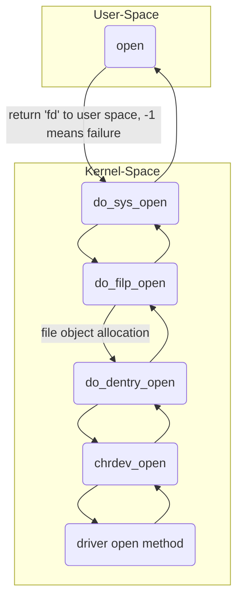

# Device Driver

Device driver is a piece of code that configures and manages a device. It exposes interfaces to the user-space so that the user application can communicate with the device. There are various categories of linux device drivers, such as character device drivers, block device drivers(sdmmc, eeprom, flash, etc), network device drivers(ethernet, wifi, bluetooth, etc).

## Character driver (char driver)

Character driver accesses data from the device sequentially byte by byte not in chunks, without any sophisticated buffering strategies. eg. RTC, keyboard, sensors, serial port, parallel port, etc.

### Character driver file operation methods

We can check the VFS file operation structure to find out types of operation methods, such as `open`, `close`, `read`, `write`, `llseek`, etc. We can find the prototypes from `linux/include/fs.h`.

#### Open Method

For the user level, the control is first passed to the kernel VFS subsystem, who will pass the control to appropriate driver's open method. VFS actually opens a file by creating a new file object and links it to the corresponding inode object.



What we can do inside the open method?

- Initialize the device or make device respond for read/write access
- Detect device initialization errors
- Check open permission (O_RDONLY, O_WRONLY, O_RDWR)
- Identify the device being opened using minor number
- Prepare device private data structure if required
- Update f_pos if required
- Open method is optional. If not provided, open will always succeed and driver is not notified.

#### Close Method

If the user program call the close method, the kernel space VFS subsystem will release the file object, only when the `f_count` field of the file object decreasing to 0, that means the last reference to the open file is closed. In summary, release(close) method does reverse operation of what open method had done.

#### Read Method

Read method actually copy the data from the driver to user space. Therefore, the read method needs to provide the pointer of current file position from which the read has to begin, read count given by user, pointer of buffer and pointer of file object.

`__user` macro is used to alert the programmer the user level pointer to avoid kernel fault caused by untrusted dereferencing. Instead, dedicated kernel functions such as `copy_to_user` and `copy_from_user` are recommended.

##### Role of `copy_to_user` and `copy_from_user`

These two functions copy data between user space and kernel space. They can check whether the user space pointer is valid or not. If an invalid address is encountered during the copy, only part of the data is copied. The return value is the amount of memory still to be copied.

##### Implementation

- Check the user requested 'count' value against `DEV_MEM_SIZE` of the device. If `f_pos (current file position) + count > DEV_MEM_SIZE`, the count value will be adjust to `count = DEV_MEM_SIZE - f_pos`.
- Copy count number of bytes from device memory to user buffer
- Update the `f_pos`
- Return number of bytes successfully read or error code
- If `f_pos` at EOF, then return 0

#### Write Method

Write system call gets connected to your driver's write method. It actually does reverse operation of read method.

#### llseek Method

`llseek` is used to alter the current file position. In the llseek method, driver should update the file pointer by using 'offset' and 'whence' information. It need to return the newly updated file position or error.

## Block driver

The device which handles data in chunks or blocks is called a block device. This type of drivers need should implement advanced buffering strategies to read and write to the block devices, and disk caches are involved. eg. hard disk, SDMMC, Nand flash, USB camera, etc.

## Device files

The driver has to create a interface at the user-space, specially called as device file. A device file gets populated in `/dev` directory during kernel boot time or device/driver hot plug events. Generally, device files are managed as part of VFS subsystem of the kernel.

To establish the connection between system call and intended driver's specific method, "device number" is designed. The "device number" consist of two parts, major number and minor number. For instance, a device driver named `/dev/rtc0` can be recognized as `4:0`, whose major part denotes the number of the driver which should be used to connect this device file and the minor part denotes the instance sequence.

Therefore, connection establishment between device file access and the driver is generally follow the process below:

- Create device number
- Create device files
- Make a device registration with VFS
- Implement the driver's file operation methods

### Inode Object

An inode is a VFS data structure (`struct inode`) that holds general information about a file. Whereas VFS 'file' data structure (`struct file`) tracks interaction on an opened file by the user process. Inode holds all information needed by the filesystem to handle a file, who has its own inode object with unique inode number to identify the file. Generally, an inode object is created and stored in memory as and when a new file (regular or device) gets created.

### File Object

Whenever a file is opened, a file object is created in kernel space, who stores information between an open file and a process. This information exits only in kernel memory during the period when a process has the file open. The contents of file object is not written back to disks unlike inode.

### Dynamic device file creation in Linux

No need to manually create the device file under `/dev` directory to access the hardware, because the user-level program such as `udev` can populate `/dev` directory with device files dynamically.

`udev` program listens to the `uevents` generated by hot plug events or kernel modules. When `udev` receives the `uevents`, it scans the subdirectories of `/sys/class` looking for the `dev` files to create device files. Each `dev` will get a corresponding device file in `/dev` directory created by udev.

- Therefore, `udev` relies on device information being exported to user space through sysfs. This process can be done using function `device_create`. It looks for a file called `dev` in `/sys/class` tree of sysfs, to determine what the major and minor number is assigned to a specific device.

- `uevents` are generated when device driver takes the help of kernel APIs to trigger the dynamic creation of device files or when a hot-pluggable device is plugged into the system.

```c
class_create // Create a directory in sysfs: /sys/class/<your_class_name>
```

```c
device_create // Create subdirectory under /sys/class/<your_class_name> with the device name
```
