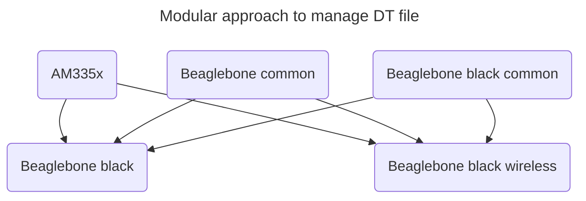
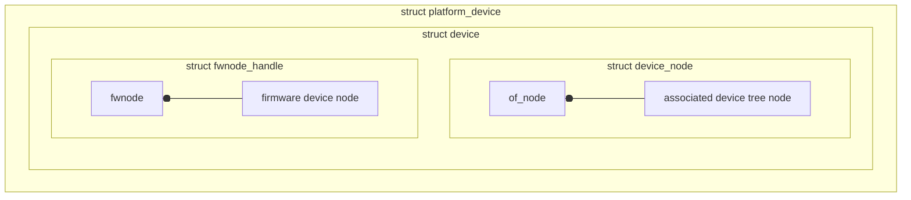

# Device Tree

The 'Open Firmware Device Tree', or simply `Device Tree(DT)`, is a data exchange format used for exchanging hardware description data with the software or OS. More specifically, it is a description of hardware that is readable by an operating system so that the operating system doesn't need to hard code details of the machine.

DT provides a language for decoupling the hardware configuration from the device driver and board support files of the Linux kernel. Using it allows devices drivers to become data-driven, less code duplication and easier to support a wide range of hardware with a single kernel image.

Generally, in Linux, DT is used for platform identification and device population that kernel parse the device tree data and generates the required software data structure, which will be used by the kernel code.

## Device Tree Writing

### Overview

The device tree supports a hierarchical way of writing hardware description at the SOC level, common board level and board-specific level. Most of time, we can reuse the common hardware information from the device tree file of the reference board.

- Device tree is a collection of device nodes, each of which represents a device, organized in some systematic way inside the device tree file. Device trees also have parent and child relationship.
- Every device tree must have one root node.

#### Root Node

The device tree has a single root node of which all other device nodes are descendants. Full root path `/`. All device trees have a root node and one `/CPUs` node with at least one `/memory` node shall present at the root.

### Device tree writing syntax

- Node name
- Node label
- Standard and custom (non-standard) property names
- Different data type representation (u32, byte, byte stream, string, stream of strings, Boolean, etc)
- SOC node and children

Custom properties are specific to a particular vendor or organization which is not documented by the specification. That is why, when you use custom property, you can find the organization name always begin at first.

You can find device tree specifications at [https://www.devicetree.org/specifications](https://www.devicetree.org/specifications/).



### Device tree bindings

The properties that are necessary to describe a device in the device tree depends on the requirements of the Linux driver for that device. When all the required properties are provided, the driver of charge can detect the device from the device tree and configure it.

**Note:** Remember to consult drivers binding document which guides you through creating device tree node for specific device. [https://docs.kernel.org/devicetree/index.html#devicetree-bindings](https://docs.kernel.org/devicetree/index.html#devicetree-bindings)

OF style matching is used for device tree style matching. We need to differentiate `id_table` with `of_match_table`.

In Linux, every device is represented by an instance of `struct device`. For every device node `struct device_node` represents details of the device node.



## Device Tree Overlay

DT overlay are device tree patches(dtbo) which are used to patch or modify the existing main device tree blob(dtb).

### Use of overlays

- To support and manage hardware configuration (properties, nodes, pin configurations) of various capes of the board.
- To alter the properties of already existing device nodes of main dtb.
- Overlays approach maintains modularity and makes capes management easier.

#### Implementation Steps

1. Create a device tree overlay file and add fragments to modify the target device nodes
2. Compile the device tree overlay file to generate `.dtbo` file (Device Tree Overlay Binary)
3. Make u-boot to load the `.dtbo` file during board start-up

[https://docs.kernel.org/devicetree/overlay-notes.html](https://docs.kernel.org/devicetree/overlay-notes.html)

```shell
# Compile to generate .dtbo
dtc -@ -I dts -O dtb -o PCDEV0.dtbo PCDEV0.dts
```

**NOTE:** If you want to use the generated `.dtbo` file through u-boot, just check the file `uboot/doc/README.fdt-overlays`. Or you can write your own `uEnv.txt` to automate this process. [uEnv-dtbo.txt](../uEnv/uEnv-dtbo.txt)
