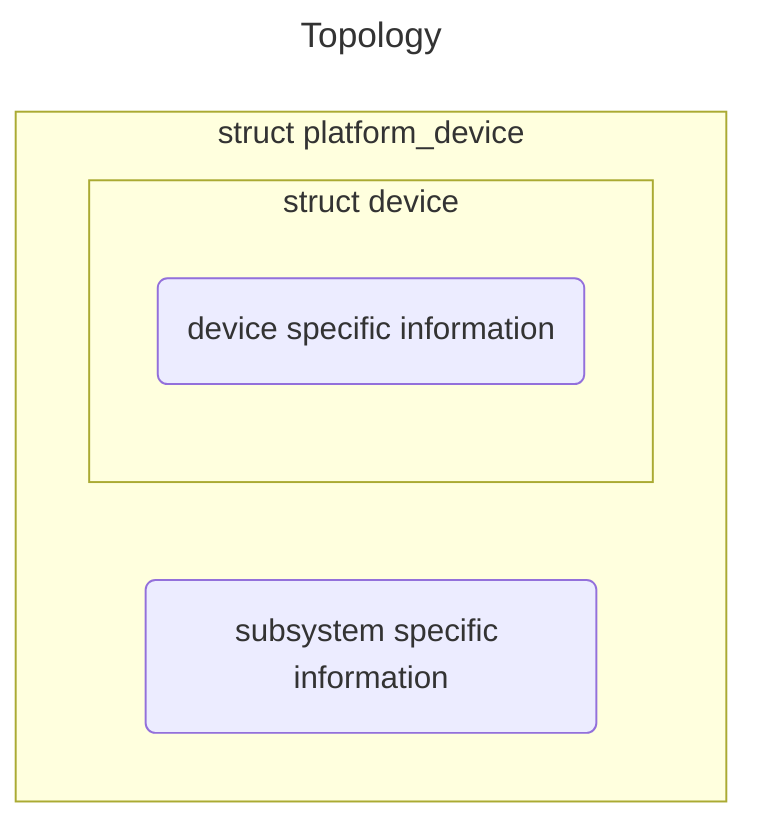
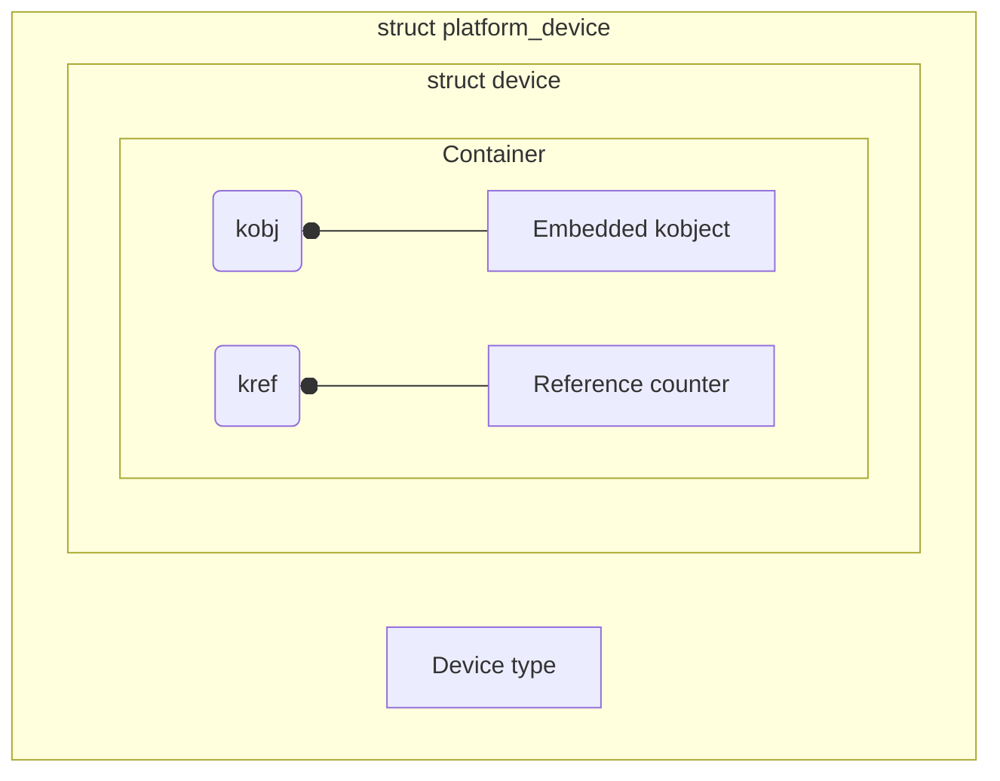

# Device Model

Linux device model is a collection of various data structures and helper functions that provide a unifying and hierarchical view of all the busses, devices, drivers present on the system. You can access the whole Linux device and driver model through a pseudo filesystem called _sysfs_, which is mounted at `/sysfs`. Different components of the Linux device model is represented as files and directories through _sysfs_.

- Device $\space \quad \qquad \rightarrow$ `struct device`
- Device driver $\quad \rightarrow$ `struct device_driver`
- Bus $\qquad \qquad \space \space \rightarrow$ `struct bus_type`
- Kobject  $\qquad \quad \space \rightarrow$ `struct kobject`
- Ksets $\qquad \qquad \rightarrow$ `struct kset`
- Kobject type $\quad \space \space \rightarrow$ `struct kobj_type`

## Device Definition

Under Linux device driver model, anything which can be represented by an instance of the data structure `struct device` is a device. The device structure contains information that the device model core needs to model the system.

## Driver Definition

Anything which can be represented by an instance of the data structure `struct device_driver` is a driver.

## Subsystem

Most subsystems track additional information about the devices they host. As a result, it is rare for devices to be represented by bare device structure. Instead, like kobject structures, is usually embedded within a higher level representation of the device.



### Kobject

`Kobject` stands for kernel object which is represented by `struct kobject`. It is a fundamental building block of Linux device and driver hierarchy, used to represent the 'containers' in the sysfs virtual filesystem and for reference counting of the 'containers'. Using **kojbects** you can add attributes to the containers, which can be viewed/altered by the user space. The sysfs filesystem gets populated on account of **kobjects**.

```c
struct kobject {
    const char          *name;
    struct list_head    entry;
    struct kobject      *parent;
    struct kset         *kset;
    struct kobj_type    *ktype;
    struct kernfs_node  *sd; /* sysfs directory entry */
    struct kref         kref;
#ifdef CONFIG_DEBUG_KOBJECT_RELEASE
    struct delayed_work release;
#endif
    unsigned int state_initialized:1;
    unsigned int state_in_sysfs:1;
    unsigned int state_add_uevent_sent:1;
    unsigned int state_remove_uevent_sent:1;
    unsigned int uevent_suppress:1;
};
```

### Containers

**Kojbects** are rarely or never used as stand-alone kernel objects. Most of the time, they are embedded in some other structure that we call container structure, which describes the device driver model's components.



### Kobject type

Type of a kobject is determined based on type of the container in which the kobject is embedded. `struct kobj_type` is used to define the default behavior for a group of kobjects of same container type. Behaviors are manifested in terms of attributes and file operation methods that handle those attributes.

The kobject type also controls what happened to the kobject when it is created and destroyed.

```c
struct kobj_type {
    /* Each kobject doesn't have its own release method, which is actually 
    provided by kobj_type object. */
    void (*release)(struct kobject *kobj);
    /* sysfs_op points to sys operation structure which lists the method 
    to operate on the default attributes created for the kobject of this type. */
    const struct sysfs_ops *sysfs_ops;
    /* The default_attrs is a list of default attributes that will be automatically
    created for any kobjcet that is registered with this ktype. */
    struct attribute **default_attrs;
    const struct kobj_ns_type_operations *(*child_ns_type)(struct kobject *kobj);
    const void *(*namespace)(struct kobject *kobj);
};
```

### Kset

Kset is a set of kobjects of same type and belongs to a specific subsystem. It is a higher-level structure which collects all lower level kobjects which belong to the same type.

The directory associated with a kobjcet always appears in the directory of the parent kobject.

```c
struct kset {
    /* The list field is the head of the doubly linked circular list of 
    kobjects included in the kset */
    struct list_head list;
    spinlock_t list_lock;
    struct kobject kobj;
    const struct kset_uevent_ops *uevent_ops;
};
```

### sysfs

`sysfs` is a virtual in-memory file system which provides representation of the kobject hierarchy of the kernel, complete topology of the devices and driver of the system in terms of directories and attributes that helps user space application to interact with devices and drivers. What's more, it provides standard methods to access devices using 'classes'.

**NOTE:** `CONFIG_SYSFS` is defined when compiling kernel.

#### kobject attribute

kobject attributes are files through which device/driver data can be exposed to sysfs so that user application can view or modify.

```c
struct attribute {
    /* This name will show in the sysfs kobject directory as attributes' name */
    const char      *name;
    /* This controls the read/write permission for the attribute file 
    from user space programs */
    umode_t         mode;
#ifdef CONFIG_DEBUG_LOCK_ALLOC
    bool            ignore_lockdep:1;
    struct lock_class_key   *key;
    struct lock_class_key   skey;
#endif
};
```

The mode of an attribute is divided into three types

- S_IRUGO, world read only
- S_IRUSR, owner read only
- S_IRUGO | S_IWUSR, world read and owner write only

Generally, `struct device_attribute` is used to create attributes for a device and to provide show/store methods. Instead of manually creating variables for `struct device_attribute` and initializing them, use the `DEVICE_ATTR_XX` macros given in `include/linux/device.h`

`sysfs_create_group` is recommended to create a group of attributes instead of calling `sysfs_create_file` to create one sysfs file each time to every attribute.

#### Show and store methods

- Show method is used to export attribute value to the user space. The differences between driver read method and driver show method are
  - Read method is used by the user space to read large amounts of data from the driver.
  - Show method is used for reading a single value data or an array of similar values or data whose length is less than PAGE_SIZE.
  - Use show method to read any configuration data of driver or device.

- Store method is used to receive a new value from the user space for an attribute.

```c
struct sysfs_ops {
    /* This function is invoked when user space program tries to read 
    the value of the attribute. buf needs to be provided by the kernel, 
    whose size is limited to PAGE_SIZE. Return the number of bytes 
    copied into the buffer or an error code. */
    ssize_t (*show)(struct kobject *, struct attribute *, char *);
    /* This function is invoked when user wants to modify the value of the 
    sysfs file. buf points to user data, whose size is limited to PAGE_SIZE. 
    Return the number of bytes used for the buffer.  */
    ssize_t (*store)(struct kobject *, struct attribute *, const char *, size_t);
};
```
