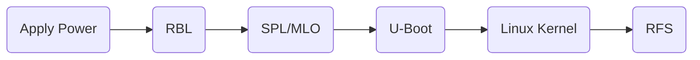

# BeagleBone Board Boot

For the successful boot of BBB, the following steps will be done after you apply power for your board.



- **RBL** means 'ROM Boot Loader', which is the first stage boot loader. It does some initialization of the system such as _Stack setup_, _MPU WDT setup_, _DPLLs and clocks configurations_ and other initialization. Then it will search memory devices or other bootable interfaces for MLO or SPL. Afterwards, it copies MLO or SPL into the internal SRAM of the chip and execute it. The _[AM335x/AM335x and AMIC110 Sitara Processors Technical Reference Manual](../share/AM335x/AM335x_and_AMIC110_Sitara_Processors_Technical_Reference_Manual.pdf)_ explains the details of this procedure, at chapter **26**.
- **SPL/MLO** means 'Second stage Program Loader' or 'Memory Loader'. It runs out of internal SRAM. RBL copies MLO from eternal memory device into internal SRAM through MMC interface, from eMMC memory, microSD card, etc. SPL and MLO are almost same except the fact that, MLO has a header which contains some info like load address, size of the image to follow, etc. These information in MLO image will be read by RBL. In summary, MLO/SPL does the following jobs:
  - It does UART console initialization to print out the debug messages.
  - Reconfigures the PLL to desired value.
  - Initialize the DDR registers to use the DDR memory.
  - Does muxing configurations of boot peripherals pin, because its next job is to load the u-boot from the boot peripherals.
  - Copies the u-boot image into DDR memory and passes control to it.
- **U-Boot** is the third stage boot loader, it runs out of DDR. In summary, u-boot does the following jobs:
  - Initialize some of the peripherals like, I2C, NAND, FLASH, ETHERNET, UART, USB, MMC, etc. Because it supports loading kernel from all these peripherals.
  - Load the linux kernel image from various boot sources to the DDR memory of the board.
  - Boot sources: USB, eMMC, SD card, Ethernet, Serial port, NAND, Flash, etc.
- **Linux Kernel** runs the linux operating system.
- **RFS** is the short cut of 'Root File System', this is provided by linux operating system image.

## Boot Files Composition

[Angstrom](https://angstrom.s3.amazonaws.com/demo/beaglebone/index.html) provides some demo files. If you want to boot a embedded linux successfully, you need **MLO**, **u-boot.img**, **am335x-boneblack.dtb**, **uEnv.txt** and **rootfs.img**.

**u-boot.img** is also named uImage(ELF binary format), which consist of 64 bytes of u-boot image header and zImage(ELF, Linux Kernel), using _mkImage_ command can append u-boot header to zImage.

**am335x-boneblack.dtb** is a 'Device Tree Binary' type file, used to cut off the dependencies of platform device enumeration from the linux kernel. Instead of adding hard coded hardware details into the linux kernel board file, every board vendors has to come up with a file called _DTS(Device Tree Source)_. This file actually consists of all details related to the board written using some pre defined syntaxes, which provides a data structure describes all the required peripherals of the board. DTS and DTSI will be complied using a Device Tree Compiler called DTC, converting DTS and DTSI files to the stream of bytes, DTB.

**uEnv.txt** is a automate tool used in boot. It describe where to find the `uImage` and `dtb` file and load them to specific addresses, which devices, such as UART0, used to print out the system information, what the rootfs type, where to load the rootfs, etc. Otherwise, you need to press `space key` to enter the U-Boot Command Terminal to do them by yourself.

## Boot Configuration

Due to the design of BeagleBone-Black board, based on S2(BBB boot button), we get boot configurations. You will notice two boot order according to the state of S2.

- S2 Released (SYSBOOT[4:0] = 11100)

    1. MMC1 (eMMC)
    2. MMC0 (SD card)
    3. UART0
    4. USB0

- S2 Pressed (SYSBOOT[4:0] = 11000)

    1. SPI0
    2. MMC0 (SD card)
    3. USB0
    4. UART0

By default, the BBB board will use eMMC boot, we can switch boot mode by pressing S2 button before board power-on.

## Image Loading

### Flash eMMC via microSD card

We can use SD card to flash eMMC. Get the [latest image](https://beagleboard.org/latest-images) from BeagleBone official website.

For instance, my BeagleBone Black RevC uses AM3358 chip, so I find `AM3358 Debian 10.3 2020-04-06 4GB eMMC IoT Flasher`, whose introduction is `Buster IoT (without graphical desktop) for BeagleBone on-board eMMC flashing via microSD card`, as target image.

It is really convenient for us to load new image.

- Prepare a SD card written with latest image.
- Insert SD card to BB-Black board, but don't power on the board.
- Press S2 boot button before you power on the board, and hold it until the 4 blue user LED turns on.
- Release S2 and wait until the 4 blue LED all turns off/on again.

On linux host like Ubuntu, if you want to write image to SD card, you need use the following command.

```bash
sudo if=<BBB-eMMC-flasher-debian-xxxx.img> of=<your sd card device file name>
```

### Flash microSD card

Flashing microSD card differs from flashing eMMC. microSD card needs to be parted to two partition, BOOT and ROOTFS.

- BOOT: 128MB, FAT16, bootable, partition type LBA.
- ROOTFS: Remained microSD card size, EXT4, partition type Linux.

You can use `GParted` GUI tools or you can just use the terminal commands.

#### Terminal Commands

- Connect microSD card.
- Find card, find new `/sd` device in `/dev` folder. If you can't determine which device is microSD, just plug it again and observe the changes.

    ```bash
    # Method 1
    ls -ltr /dev/ | grep -i sd
    # Method 2
    sudo fdisk -l
    # Except mentioned above
    dmesg
    ```

- Remove first partition.

    ```bash
    sudo dd if=/dev/zero of=/dev/<sdx, according to your microSD card> bs=1M count=16
    ```

- Create partition.

    ```bash
    sudo cfdisk /dev/<sdx, according to your microSD card>
    ```

    1. Select label type `dos`.
    2. Select `New` to create new partition with 256M size.
    3. Change partition type to `W95 FAT16 (LBA)`.
    4. Change partition to `Bootable`.
    5. Select `New` again to create another partition with remained size.
    6. Change partition type to `Linux`.
    7. Quit.

- View all partitions to confirm your changes made.

    ```bash
    cat /proc/partitions | grep <sdx, according to your microSD card>
    ```

- Format first partition 'sdx1' and second partition 'sdx2'

    ```bash
    # Pleas umount them first
    sudo mkfs.vfat -F 32 -n BOOT /dev/sdx1
    sudo mkfs.ext4 -L ROOTFS -E nodiscard /dec/sdx2
    ```

After all above done, copy `MLO`, `u-boot.img`, `zImage`, `am335x-boneblack.dtb` to `/BOOT` and your root file system unpacked from image to `/ROOTFS`. You can write your own `uEnv.txt` to automate the boot process.
